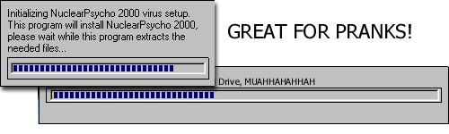



## Nuclear Psycho 2000 Fake Viri \(Good Prank for friends\!\)

### Description

This is my second source code released on PlanetSourceCode. It is a fake virus that you can compile and send to friends, there is no way to get out of it. It disables CTRL-ALT-DEL and hide the windows start menu, and desktop icons, so they cant do anything. If you find any bugs, please tell me. THIS DOES NOT WORK FOR WINDOWS NT.
 
### More Info
 

             |
---                |---
**Submitted On**   |2000-11-09 04:53:18
**By**             |[Crash Overide](https://github.com/Planet-Source-Code/PSCIndex/blob/master/ByAuthor/crash-overide.md)
**Level**          |Beginner
**User Rating**    |4.0 (16 globes from 4 users)
**Compatibility**  |VB 5\.0, VB 6\.0
**Category**       |[Jokes/ Humor](https://github.com/Planet-Source-Code/PSCIndex/blob/master/ByCategory/jokes-humor__1-40.md)
**World**          |[Visual Basic](https://github.com/Planet-Source-Code/PSCIndex/blob/master/ByWorld/visual-basic.md)
**Archive File**   |[CODE\_UPLOAD115071192000\.zip](https://github.com/Planet-Source-Code/crash-overide-nuclear-psycho-2000-fake-viri-good-prank-for-friends__1-12665/archive/master.zip)

